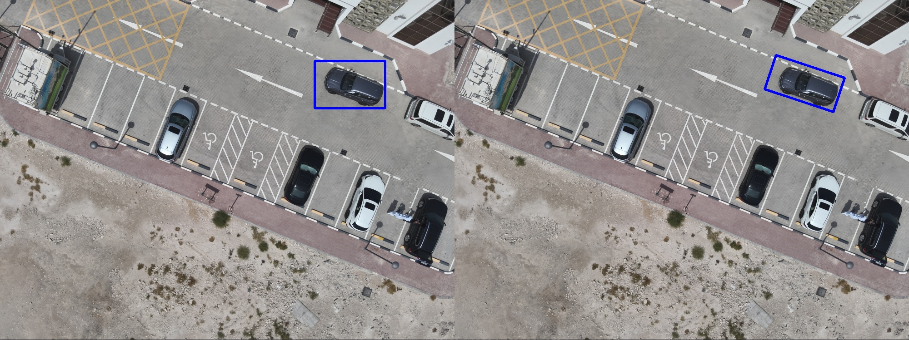

# Introduction
This project aims to develop a system for detecting illegal parking using drones. Drones will be sent out by the relevant authorities on missions, where they will follow a designated route and take pictures of the street below to catch any illegally parked cars (IPCs). The system will then utilize computer vision techniques to process these images and identify vehicles parked in prohibited areas and send alerts to the authorities.

> **Note:** This project is developed as part of the course project for MECH420 - Introduction to Drones at Qatar University.

# Getting Started

## Prerequisites
- Python 3.6 or higher
- Drone images (our procedure can be found in the [Data Collection](#data-collection) section)
- [ExifTool](https://exiftool.org/) (extract to folder and add to PATH environment variable)
- [Darknet](https://github.com/hank-ai/darknet)
- [DarkHelp](https://github.com/stephanecharette/DarkHelp)

## Getting Started
1. Clone this repository: `git clone https://github.com/MFauzanAP/Illegal-Parking-Detection.git`
2. Install the required dependencies: `pip install -r requirements.txt`
3. Open `main.py` and comment out any directories that are not needed in `OUTPUT_DIRS`. A description of each directory is given in [Output Directories](#output-directories)
4. View the results in the `output` directory

## Training the Model

1. Follow the steps given in the [Darknet Building Instructions](https://github.com/hank-ai/darknet/tree/master?tab=readme-ov-file#windows-cmake-method)
2. If present, fix `CUDA compiler not found` issue by following the steps here: [CUDA Compiler Not Found](https://stackoverflow.com/questions/56636714/cuda-compile-problems-on-windows-cmake-error-no-cuda-toolset-found)
3. Continue installation process
4. Build and install [DarkHelp](https://github.com/stephanecharette/DarkHelp?tab=readme-ov-file#building-darkhelp-windows)

## Output Directories

The following list shows the available output directories and their descriptions. A sample output is provided in the `output` directory.

- `grid-resized`: This is required for the machine learning model to work. It contains the source images tiled into a 2x2 grid with black tiles.
- `cars`: Contains the output of the car detection model with annotated bounding boxes.
- `cars-json`: Output of the car detection model in JSON format.
- `cars-bbox`: Shows the source images with the bounding boxes drawn around the detected cars.
- `cars-bbox-only`: Black images with bounding boxes where cars were detected.
- `flow`: Processed optical flow images.
- `flow-bbox`: Source images with the bounding boxes drawn around areas of motion.
- `flow-bbox-only`: Black images with bounding boxes where motion was detected.
- `camera`: GeoJSON files with the camera locations and image corners.
- `parking`: Parking spots projected onto the source images.
- `parking-bbox-only`: Black images with bounding boxes where parking spots were detected.
- `ipc`: Source images with bounding boxes around the illegally parked cars drawn on them.
- `ipc-only`: Individual snippets of the illegally parked cars.
- `point-cloud`: Point cloud data for the illegally parked cars.
- `combined-flow`: Shows the warped images with feature tracks drawn and the final output flow image.
- `combined-ipc`: Overlays the car, flow, and parking bounding boxes into a single image.
- `combined-ipc-only`: Combines all IPC snippets in each frame into a single image

# Processing Pipeline

# Data Collection

| Parameter | Value |
| --- | --- |
| Drone | DJI Mavic 3T |
| Flight Altitude | 50 m |
| Flight Speed | 5 m/s |
| Ground Sampling Distance | 1.5 cm/pixel |
| Flight Time | ~1 minute |
| Mission Type | Area Mapping |

We used a DJI Mavic 3T drone to capture images of the area. The drone was flown at an altitude of 50 meters with a speed of 5 m/s. The ground sampling distance was set to 1.5 cm/pixel. The flight time was approximately 1 minute. The drone was set to fly in a grid pattern to capture images of the area.

# How did we do it?

> **Note:** Our team consists of four mechanical engineering students and one electrical engineering student. We had no prior experience in computer vision or machine learning, so we had trouble figuring out what was possible and what was not. We had to learn everything from scratch, which was a challenging but rewarding experience.

When brainstorming ideas for detecting IPCs, one of the first risks we tried to plan for was moving cars being flagged as an IPC. we initially came up with two ideas to combat this:

- **Option 1**: Construct an orthomosaic of the scanned area and overlay many of them with decreased opacity to filter out moving objects.
- **Option 2**: Try to somehow detect which parts of the image have changed between frames and only flag those as IPCs.

At first, we weren't aware of all the different techniques available to us, so we decided to first investigate the seemingly simpler option 1. This was because, prior to this, we found many tools to stitch orthomosaics from drone imagery, such as [OpenDroneMap](https://github.com/OpenDroneMap/WebODM) which we successfully got up and running. However, after playing around with it and trying to overlay multiple orthomosaics, we realized that this was not a viable solution. The orthomosaics were too large and the process was too slow to be practical. We then decided to investigate option 2.

## Motion Detection

After a lot of research, we came across a technique in computer vision called **optical flow** which allows you to detect motion between frames. Two types existed, *sparse* and *dense*. Sparse optical flow is faster, but only identifies the motion of specific pixels (or features) between the two frames. Dense optical flow on the other hand was slower, but gave us patches of motion from one frame to the next. We thought this suited our project better, so we decided to go with dense optical flow.

\
*Sparse vs. Dense Optical Flow*

### Perspective Warping

One issue was, these techniques were often used for **fixed** cameras, not for drones with moving cameras. We had to figure out a way to somehow *move* or *warp* the previous frame to be aligned with the current frame. This was a difficult problem to solve, but we eventually found a solution in the form of **perspective warping**, which curiously enough, was also used in the construction of orthomosaics. Thus, we looked for different orthomosaicking tools (in python for easier translation) and tried to figure out how they achieved it. Turns out it was a combination of:

1. **Feature Detection**: Detecting prominent features in both images for tracking.
2. **Feature Matching**: Matching these features between the two frames.
3. **Homography Matrix Calculation**: Construct a [homography matrix](https://en.wikipedia.org/wiki/Homography_(computer_vision)) from these matches.
4. **Perspective Warping**: Warp the previous frame using the homography matrix to align it with the current frame.

This is done in the [`match_and_warp` function](https://github.com/MFauzanAP/Illegal-Parking-Detection/blob/main/lib/motion_detection.py#L48). As seen there, we used `cv.SIFT_create()` for detecting features, `cv.BFMatcher()` for matching them, `cv.findHomography()` for calculating the homography matrix, and `cv.warpPerspective()` to warp the previous frame. One catch was, after the image had been warped, there were black areas around the edges where the image had been stretched.

\
*Black Areas in Warped Image*

To fix this, we just implemented a fallback to the current frame for these areas. The following image shows the previous frame on the left, the warped frame in the middle, and the current frame on the right. However, some inconsistencies can be seen in the warped result, especially when the drone is turning between frames. Ultimately, after some playing around with the parameters, we managed to get good results, and in hindsight, we realized that this was not too big of a problem.

\
*Result (middle) of warping the previous image (left) to the current image (right). Note the large difference in perspective of the building at the bottom of the image. This will be a bit of an issue later on.*

### Optical Flow

After having warped the previous frame to align with the current frame, we could now calculate the dense optical flow between them. At first, we used the `cv.calcOpticalFlowFarneback()` function from OpenCV, which gave decent results. There were some minor issues (inherently due to our lack of understanding) such as the algorithm detecting flow in areas where the warping had many errors. But after some time we realized it was because we had normalized the flow values, which meant that in frames with not much motion, the slightest movement would be detected as a large flow. Additionally, since we flew the drone in a relatively low altitude (50m), tall objects would have large flows due to the perspective shift. Also, on the day of the mission, there were many birds flying around, which the algorithm also detected as motion.

\
*The building at the bottom has large flows due to the perspective shift. Note that for reference, this is from the same frame as the image above*

\
*Normalized flows in a frame with not much motion, notice the large flows detected on the ground, but when looking at the compared images above, there does not seem to be much motion*

\
*Birds (small colored dots) and lamp post perspective shift detected as flow*

Ultimately, we managed to fix these issues by doing the following steps outlined below. The implementation for all of these can be found in the [`plot_flow` function](https://github.com/MFauzanAP/Illegal-Parking-Detection/blob/main/lib/motion_detection.py#L75).

- **Switch to `DISOpticalFlow_create`**: We found that this algorithm gave more consistent and connected flows for cars, which was what we were looking for.
- **Unnormalize and Threshold the Flows**: Instead of normalizing the flows, we decided to instead apply a minimum and maximum threshold to the flow values. This way, we could filter out the small flows (warping issues) and the extremely large flows due to perspective shift. The parameter for this was obtained through trial and error for our specific case.
- **Reduce Colors to Identify Distinct Flows**: We found that by using [color quantization](https://machinelearningmastery.com/k-means-clustering-in-opencv-and-application-for-color-quantization/), we were able to easily distinguish between flows in different directions. This way, we only had a cluster of colors, which will be used in the next step.
- **Filter out Non-Car-Like Flows**: After staring at the flow images for a while, we realized that cars had a distinct flow pattern. They were moderately large, often connected, and had a rectangular-ish shape, whilst the others were often either large, disconnected, thin streaks, or unnatural abstract patterns. To filter these, we extracted contours from the image obtained previously, and calculated the area, perimeter, and circularity of each contour. We then filtered out the contours that did not fit the criteria of a car-like flow.

\
*We can see a huge improvement in the flow image after applying the above steps! Notice the lack of colors around the warped edges, the lamp posts aren't classified as moving, and the clearer, single-colored blob on top of the moving car*

From here, all that was left was to draw bounding boxes around the areas of motion for later use. This was easily done using `cv.minAreaRect`. Note however, that this function does not give a regular bounding box, but instead an oriented one. This actually works in our favour as it means our detection will be more accurate. Below is an example of a normal bounding box and an oriented one.

\
*See how the bounding box (left) on the right doesn't properly fit the car? This effect is more pronounced when the car is at an angle, which is why we used oriented bounding boxes (right).*

Now, we've successfully detected motion in the images. The next thing we worked on was trying to figure out the parking areas.

## Parking Spot Detection

One core feature we needed to implement was to distinguish between cars that are legally parked and those that aren't. Intuitively, there are two ways to detect parking spots:

1. **Machine Learning**: Train a model to detect parking spots in the images.
2. **Manually Detect Parking Spots**: Use a tool to manually draw parking spots on the images.

However, at this point in time, we did not know much about machine learning. The first option seemed too complex and require too much investment, as it meant we needed to find existing data for training, learn about setting up a machine learning framework, and then how to use it to annotate the images. The second option seemed more feasible, but we had to find a tool that could do this. Eventually, we found something called GeoJSON which is a way to store shapes and polygons on a 2D map based on coordinates.

Using [GeoJSON.io](https://geojson.io/) we located our mission location, and manually drew out the parking spots that were being investigated. We then exported this as a GeoJSON file and included it in each of our datasets (from the mission).

# References / Resources

- [ExifTool](https://exiftool.org/)
- [Darknet]()
- [DarkHelp]()
- [OpenDroneMap](https://github.com/OpenDroneMap/WebODM)
- [ATG-PVD Dataset](https://sites.google.com/view/atg-pvd/dataset?authuser=0)
- [Color Quantization](https://machinelearningmastery.com/k-means-clustering-in-opencv-and-application-for-color-quantization/)
- [GeoJSON.io](https://geojson.io/)
