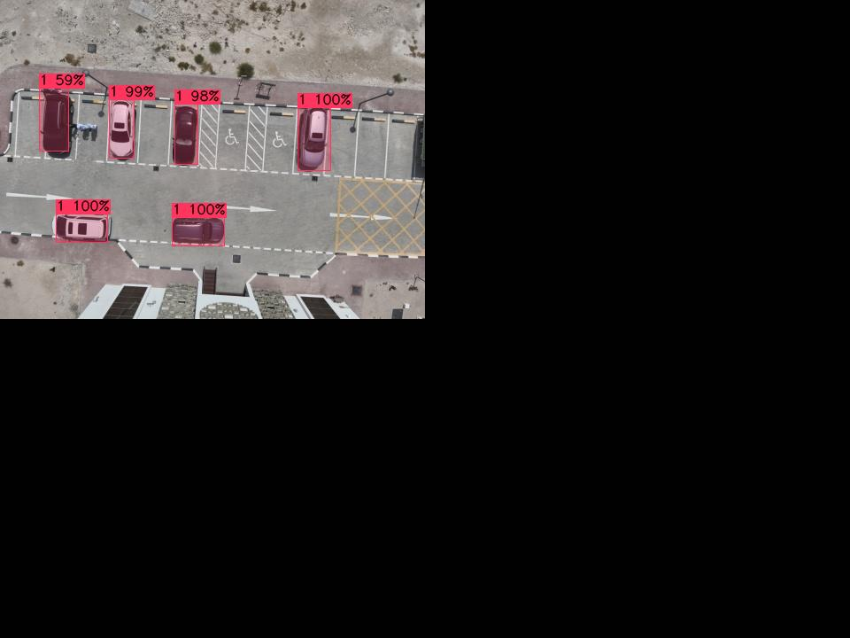

# Introduction
This project aims to develop a system for detecting illegal parking using drones. Drones will be sent out by the relevant authorities on missions, where they will follow a designated route and take pictures of the street below to catch any illegally parked cars (IPCs). The system will then utilize computer vision techniques to process these images and identify vehicles parked in prohibited areas and send alerts to the authorities.

> **Note:** This project is developed as part of the course project for MECH420 - Introduction to Drones at Qatar University. Although we were not fully qualified or experienced enough for it, we managed to produce results that we are proud of Alhamdulillah, and learnt a lot in the process.

## Table of Contents
- [Getting Started](#getting-started)
  - [Prerequisites](#prerequisites)
  - [Getting Started](#getting-started)
  - [Training the Model](#training-the-model)
  - [Output Directories](#output-directories)
- [Processing Pipeline](#processing-pipeline)
- [Data Collection](#data-collection)
- [How did we do it?](#how-did-we-do-it)
  - [1. Motion Detection](#1-motion-detection)
	- [1.1. Perspective Warping](#11-perspective-warping)
	- [1.2. Optical Flow](#12-optical-flow)
  - [2. Parking Spot Detection](#2-parking-spot-detection)
  - [3. Car Detection](#3-car-detection)
	- [3.1. Model Training](#31-model-training)
	- [3.2. Model Performance](#32-model-performance)
	- [3.3. Model Integration](#33-model-integration)
  - [4. Finding Illegally Parked Cars](#4-finding-illegally-parked-cars)
- [Future Work](#future-work)
- [References / Resources](#references--resources)

# Getting Started

## Prerequisites
- Python 3.6 or higher
- Drone images (our procedure can be found in the [Data Collection](#data-collection) section)
- [ExifTool](https://exiftool.org/) (extract to folder and add to PATH environment variable)
- [Darknet](https://github.com/hank-ai/darknet)
- [DarkHelp](https://github.com/stephanecharette/DarkHelp)

## Getting Started
1. Clone this repository: `git clone https://github.com/MFauzanAP/Illegal-Parking-Detection.git`
2. Install the required dependencies: `pip install -r requirements.txt`
3. Open `main.py` and comment out any directories that are not needed in `OUTPUT_DIRS`. A description of each directory is given in [Output Directories](#output-directories)
4. View the results in the `output` directory

## Training the Model

1. Follow the steps given in the [Darknet Building Instructions](https://github.com/hank-ai/darknet/tree/master?tab=readme-ov-file#windows-cmake-method)
2. If present, fix `CUDA compiler not found` issue by following the steps here: [CUDA Compiler Not Found](https://stackoverflow.com/questions/56636714/cuda-compile-problems-on-windows-cmake-error-no-cuda-toolset-found)
3. Continue installation process
4. Build and install [DarkHelp](https://github.com/stephanecharette/DarkHelp?tab=readme-ov-file#building-darkhelp-windows)

## Output Directories

The following list shows the available output directories and their descriptions. A sample output is provided in the `output` directory.

- `grid-resized`: This is required for the machine learning model to work. It contains the source images tiled into a 2x2 grid with black tiles.
- `cars`: Contains the output of the car detection model with annotated bounding boxes.
- `cars-json`: Output of the car detection model in JSON format.
- `cars-bbox`: Shows the source images with the bounding boxes drawn around the detected cars.
- `cars-bbox-only`: Black images with bounding boxes where cars were detected.
- `flow`: Processed optical flow images.
- `flow-bbox`: Source images with the bounding boxes drawn around areas of motion.
- `flow-bbox-only`: Black images with bounding boxes where motion was detected.
- `camera`: GeoJSON files with the camera locations and image corners.
- `parking`: Parking spots projected onto the source images.
- `parking-bbox-only`: Black images with bounding boxes where parking spots were detected.
- `ipc`: Source images with bounding boxes around the illegally parked cars drawn on them.
- `ipc-only`: Individual snippets of the illegally parked cars.
- `point-cloud`: Point cloud data for the illegally parked cars.
- `clustered-point-cloud`: Color-coded point cloud data for the illegally parked cars.
- `combined-flow`: Shows the warped images with feature tracks drawn and the final output flow image.
- `combined-ipc`: Overlays the car, flow, and parking bounding boxes into a single image.
- `combined-ipc-only`: Combines all IPC snippets in each frame into a single image

# Processing Pipeline

# Data Collection

We used a DJI Mavic 3T drone to capture images of the area. The drone was flown at an altitude of 50 meters with a speed of 5 m/s. The ground sampling distance was set to 1.5 cm/pixel. The flight time was approximately 1 minute. The drone was set to fly in a grid pattern to capture images of the area.

| Parameter | Value |
| --- | --- |
| Drone | DJI Mavic 3T |
| Flight Altitude | 50 m |
| Flight Speed | 5 m/s |
| Ground Sampling Distance | 1.5 cm/pixel |
| Flight Time | ~1 minute |
| Mission Type | Area Mapping |

However, there are some changes we would like to make in the future:

- **Higher Altitude**: The drone should fly at a higher altitude to capture more of the area and reduce the error from the perspective shift.
- **DJI Phantom**: We would like to use a DJI Phantom drone if given the opportunity as it has a top down camera which would reduce the effect of the drone orientation on the images.
- **Waypoint Mission**: Performing a waypoint mission would allow us to capture a larger area and specifically target areas where illegal parking is common.

Additional information on future work can be found in the [Future Work](#future-work) section.

# How did we do it?

> **Note:** Our team consists of four mechanical engineering students and one electrical engineering student. We had no prior experience in computer vision or machine learning, so we had trouble figuring out what was possible and what was not. We had to learn everything from scratch, which was a challenging but rewarding experience.

When brainstorming ideas for detecting IPCs, one of the first risks we tried to plan for was moving cars being flagged as an IPC. we initially came up with two ideas to combat this:

- **Option 1**: Construct an orthomosaic of the scanned area and overlay many of them with decreased opacity to filter out moving objects.
- **Option 2**: Try to somehow detect which parts of the image have changed between frames and only flag those as IPCs.

At first, we weren't aware of all the different techniques available to us, so we decided to first investigate the seemingly simpler option 1. This was because, prior to this, we found many tools to stitch orthomosaics from drone imagery, such as [OpenDroneMap](https://github.com/OpenDroneMap/WebODM) which we successfully got up and running. However, after playing around with it and trying to overlay multiple orthomosaics, we realized that this was not a viable solution. The orthomosaics were too large and the process was too slow to be practical. We then decided to investigate option 2.

## 1. Motion Detection

After a lot of research, we came across a technique in computer vision called **optical flow** which allows you to detect motion between frames. Two types existed, *sparse* and *dense*. Sparse optical flow is faster, but only identifies the motion of specific pixels (or features) between the two frames. Dense optical flow on the other hand was slower, but gave us patches of motion from one frame to the next. We thought this suited our project better, so we decided to go with dense optical flow.

	

	
<i>Sparse vs. Dense Optical Flow</i>

### 1.1. Perspective Warping

One issue was, these techniques were often used for **fixed** cameras, not for drones with moving cameras. We had to figure out a way to somehow *move* or *warp* the previous frame to be aligned with the current frame. This was a difficult problem to solve, but we eventually found a solution in the form of **perspective warping**, which curiously enough, was also used in the construction of orthomosaics. Thus, we looked for different orthomosaicking tools (in python for easier translation) and tried to figure out how they achieved it. Turns out it was a combination of:

1. **Feature Detection**: Detecting prominent features in both images for tracking.
2. **Feature Matching**: Matching these features between the two frames.
3. **Homography Matrix Calculation**: Construct a [homography matrix](https://en.wikipedia.org/wiki/Homography_(computer_vision)) from these matches.
4. **Perspective Warping**: Warp the previous frame using the homography matrix to align it with the current frame.

This is done in the [`match_and_warp` function](https://github.com/MFauzanAP/Illegal-Parking-Detection/blob/main/lib/motion_detection.py#L48). As seen there, we used `cv.SIFT_create()` for detecting features, `cv.BFMatcher()` for matching them, `cv.findHomography()` for calculating the homography matrix, and `cv.warpPerspective()` to warp the previous frame. One catch was, after the image had been warped, there were black areas around the edges where the image had been stretched.

	

	
<i>Black Areas in Warped Image</i>

To fix this, we just implemented a fallback to the current frame for these areas. The following image shows the previous frame on the left, the warped frame in the middle, and the current frame on the right. However, some inconsistencies can be seen in the warped result, especially when the drone is turning between frames. Ultimately, after some playing around with the parameters, we managed to get good results, and in hindsight, we realized that this was not too big of a problem.

	

	
<i>Result (middle) of warping the previous image (left) to the current image (right). Note the large difference in perspective of the building at the bottom of the image. This will be a bit of an issue later on.</i>

### 1.2. Optical Flow

After having warped the previous frame to align with the current frame, we could now calculate the dense optical flow between them. At first, we used the `cv.calcOpticalFlowFarneback()` function from OpenCV, which gave decent results. There were some minor issues (inherently due to our lack of understanding) such as the algorithm detecting flow in areas where the warping had many errors. But after some time we realized it was because we had normalized the flow values, which meant that in frames with not much motion, the slightest movement would be detected as a large flow. Additionally, since we flew the drone in a relatively low altitude (50m), tall objects would have large flows due to the perspective shift. Also, on the day of the mission, there were many birds flying around, which the algorithm also detected as motion.

	

	
<i>The building at the bottom has large flows due to the perspective shift. Note that for reference, this is from the same frame as the image above</i>

	

	
<i>Normalized flows in a frame with not much motion, notice the large flows detected on the ground, but when looking at the compared images above, there does not seem to be much motion</i>

	

	
<i>Birds (small colored dots) and lamp posts detected as motion in the flow image</i>

Ultimately, we managed to fix these issues by doing the following steps outlined below. The implementation for all of these can be found in the [`plot_flow` function](https://github.com/MFauzanAP/Illegal-Parking-Detection/blob/main/lib/motion_detection.py#L75).

- **Switch to `DISOpticalFlow_create`**: We found that this algorithm gave more consistent and connected flows for cars, which was what we were looking for.
- **Unnormalize and Threshold the Flows**: Instead of normalizing the flows, we decided to instead apply a minimum and maximum threshold to the flow values. This way, we could filter out the small flows (warping issues) and the extremely large flows due to perspective shift. The parameter for this was obtained through trial and error for our specific case.
- **Reduce Colors to Identify Distinct Flows**: We found that by using [color quantization](https://machinelearningmastery.com/k-means-clustering-in-opencv-and-application-for-color-quantization/), we were able to easily distinguish between flows in different directions. This way, we only had a cluster of colors, which will be used in the next step.
- **Filter out Non-Car-Like Flows**: After staring at the flow images for a while, we realized that cars had a distinct flow pattern. They were moderately large, often connected, and had a rectangular-ish shape, whilst the others were often either large, disconnected, thin streaks, or unnatural abstract patterns. To filter these, we extracted contours from the image obtained previously, and calculated the area, perimeter, and circularity of each contour. We then filtered out the contours that did not fit the criteria of a car-like flow.

	

	
<i>We can see a huge improvement in the flow image after applying the above steps! Notice the lack of colors around the warped edges, the lamp posts aren't classified as moving, and the clearer, single-colored blob on top of the moving car</i>

From here, all that was left was to draw bounding boxes around the areas of motion for later use. This was easily done using `cv.minAreaRect`. Note however, that this function does not give a regular bounding box, but instead an oriented one. This actually works in our favour as it means our detection will be more accurate. Below is an example of a normal bounding box and an oriented one.

	

	
<i>See how the bounding box (left) on the right doesn't properly fit the car? This effect is more pronounced when the car is at an angle, which is why we used oriented bounding boxes (right).</i>

Now, we've successfully detected motion in the images. The next thing we worked on was trying to figure out the parking areas.

## 2. Parking Spot Detection

One core feature we needed to implement was to distinguish between cars that are legally parked and those that aren't. Intuitively, there are two ways to detect parking spots:

1. **Machine Learning**: Train a model to detect parking spots in the images.
2. **Manually Detect Parking Spots**: Use a tool to manually draw parking spots on the images.

However, at this point in time, we did not know much about machine learning. The first option seemed too complex and require too much investment, as it meant we needed to find existing data for training, learn about setting up a machine learning framework, and then how to use it to annotate the images. The second option seemed more feasible, but we had to find a tool that could do this. Eventually, we found something called GeoJSON which is a way to store shapes and polygons on a 2D map based on coordinates.

Using [GeoJSON.io](https://geojson.io/) we located our mission location, and manually drew out the parking spots that were being investigated. We then exported this as a GeoJSON file and included it in each of our datasets (from the mission). Then, we created a new component in our pipeline to project these parking spots onto the images. One difficulty with this was that the pictures taken weren't exactly top-down, so the parking spots were often skewed. We had to figure out a way to calculate the geographic coordinates of any pixel on our image.

Thankfully, we found a python library called [`cameratransform`](https://cameratransform.readthedocs.io/en/latest/index.html) which handled all the required math for us. All we needed was:

- The camera's focal length
- The camera's sensor size
- The final image size
- The drone's altitude
- The drone's GPS coordinates

Fortunately, DJI provides all of this information in the image's metadata. We used [ExifTool](https://exiftool.org/) to extract this information and then used it to initialize the `cameratransform` object. Initially, we wanted to verify our calculations and values were correct, so we recorded the geographic coordinates of the corners of the images, and created a GeoJSON file with these points. We then imported this into GeoJSON.io and verified that the corners of the image were correctly placed on the map. Doing this led to a few tweaks such as using the relative altitude of the drone instead of the absolute altitude, and aligning the yaw axis of the drone to be the same as what is used in `cameratransform`. All of this can be seen in the [`init_camera`](https://github.com/MFauzanAP/Illegal-Parking-Detection/blob/main/lib/geojson_plotter.py#L102) and [`plot_camera`](https://github.com/MFauzanAP/Illegal-Parking-Detection/blob/main/lib/geojson_plotter.py#L123) functions.

	

	
<i>The left image shows the corners of the image projected on a satellite map, the right image shows the actual captured photo. Note that the satellite map is slightly off, so the representation is not 100% accurate.</i>

After we have verified our projection method to be working, we went ahead and loaded the initial GeoJSON file with the parking spots, and projected them onto the images. This was done by iterating through the points, calling `cam.imageFromGPS` on each point, and creating an oriented bounding box around the projected points. The final result can be seen below.

	

	
<i>Although it seems like the green overlay is slightly off (human error whilst creating the GeoJSON file, this is a disadvantage of our method), this does not matter much in our case as it still covers all the cars in question.</i>

Now the last thing we needed before we could start detecting IPCs was to detect the cars in the images.

## 3. Car Detection

This part was arguably the most challenging part of the project, mostly because we had no prior experience with machine learning. Initially, we tried to use pre-trained models from RoboFlow, but we quickly realized that these models were not trained on the type of data we had. We then realized that we had to train our own model, but we had no idea how to do this. After some research, we found a tool called [Darknet](https://github.com/hank-ai/darknet), which is a neural network framework that makes it easy to train models on custom datasets. Tied closely to Darknet was a tool called [DarkHelp](https://github.com/stephanecharette/DarkHelp), which made the work more abstracted and easier to understand.

### 3.1. Model Training

After successfully setting up the tools needed (and testing on one of the provided datasets/models), we started searching for a dataset to train on. In hindsight, we should have used the [ATG-PVD Dataset](https://sites.google.com/view/atg-pvd/dataset?authuser=0) which was more suitable for our use case, however at the time we did not realize this, and instead went for another vehicle detection dataset for aerial imagery called [VAID](https://ieeexplore.ieee.org/document/9268932). This dataset contained many low-altitude, overhead images of cars in Taiwan. Although it seems suitable at first, we realized later on that the altitude of the images was higher than what we had, and the number of classes was 7 which included things like trailers, motorcycles, and buses, which were not relevant to our use case. Although we went ahead with it anyway, this could be a potential area for improvement in the future.

	

	
<i>An example of one of the images we used for training. Notice the presence of trucks, which slightly affects our model's performance.</i>

To split the dataset into training and testing, we utilized a package called `pylabel` which also allowed us to convert the annotations from the `VOC` format used by the dataset to the `YOLO` format used by Darknet. Finally, before starting the training, we had to create a configuration file for the model. This was done by copying the `yolov4-tiny-custom.cfg` file from the Darknet repository, and modifying it to fit our dataset. This included changing the number of classes, the number of filters, the network size, etc. Once everything was ready, we started the training process.

### 3.2. Model Performance

The training process was done on a local machine with a GTX 1080 GPU. The training took around 5 hours to complete, and the final model had a mAP of 0.8686. At first, this seems to be very good, however after looking at the mAP for each of the classes, we realized that the model was not performing well on the car class. This may be due to the presence of other classes, meaning the training process was focused on improving the average mAP, which meant the car class was not as well trained as it could have been. The best mAP for the car class was 0.7743, whilst for a class like the bus, it was 0.9865.

	

	
<i>On the left we have the performance curve for the Car class, and on the right we have the curve for the Bus class. We see that at some point, the Car had better mAP, but since we were training for all classes, it meant the weights for this result were discarded.</i>

Fortunately, after testing the model on some of our sample images, we found that the model was performing well enough for our use case. The model was able to detect cars in the images, and the bounding boxes were accurate enough for our purposes. One modification we had to make was to tile the input image with black tiles to make it a 2x2 grid. This was because the training images were for higher altitudes, and so the cars in those images were about half the size. By tiling the images, we could simulate the effect of a higher altitude for our images, resulting in better detection. In fact, without doing this, the model would not detect any cars at all.

	

	
<i>Tiling the images like above allows us to properly detect the cars from our mission</i>

### 3.3. Model Integration

To integrate the trained model into our pipeline, we created a new `model` folder with the best weights obtained, as well as a modified configuration file with different batch sizes and subdivisions. We then imported the `DarkHelp.py` file from the official repo to perform inference on the images. One slight hiccup we faced was that the coordinates had to be transformed back to the original image size, as the inference was done on the tiled images. But in the end, we managed to get the model working and detecting cars in the images.

	

	
<i>Our pipeline was able to extract bounding boxes of cars, with some false positives here and there however.</i>

Unfortunately however, we found that the model produced some false positives from time to time. As seen in the image above, the model detected a window as a car. We think this is partly caused by the training images containing too much information that was not relevant to our use case, and in different climate and conditions as well. It may have seen a trailer or bus that looked similar to our window, and thus classified it as a car. This is an area for improvement in the future.

## 4. Finding Illegally Parked Cars

	

	
<i>We tried to black out one of the moving cars and see if the model would tag it as a car. Pay attention to the car at the bottom of the image.</i>

At the very start of the project, we thought of blacking out the parking spots and motion areas to detect IPCs as we thought the model wouldn't be able to detect cars in these areas. However, after some testing, we found that the model *was* able to detect the cars, and so we decided to explore a different approach.

### 4.1. Combining the Information

The final step was to combine all the information we had gathered so far to detect IPCs. We first start by looping through each car in the car detection bounding boxes. For each one, we check if it intersects with any of the parking spot bounding boxes. If it does, we classify it as a non-IPC. Then we check if the car intersects with any of the motion bounding boxes. If it does, we classify it as a non-IPC. If a car does not meet any of the above conditions, we classify it as an IPC. To detect for intersection, we used the [`ccw`](https://github.com/MFauzanAP/Illegal-Parking-Detection/blob/main/lib/ipc_detection.py#L59) function to check if any line in both contours intersect with each other. Additionally, we also needed to check if a point in one contour is in the other, meaning the two bounding boxes are overlapping. This was done using the `cv.pointPolygonTest` function.

	

	
<i>Resulting image after combining the car, motion, and parking bounding boxes together. What we are interested in are the red colored boxes</i>

Although the process seems very time-consuming and inefficient, it was fast enough for our simple use case (although this is a potential area for future work). The final result was a set of bounding boxes around the illegally parked cars. For each of these, we took a snippet of the image and recorded the time and location of the car. This will be used later on to create a point cloud of the IPCs. The entire process can be seen in the [`plot_point_cloud`](https://github.com/MFauzanAP/Illegal-Parking-Detection/blob/main/lib/ipc_detection.py#L84) function.

	

	
<i>The algorithm isn't 100% accurate as shown here, it thinks the panel at the top is a car (due to error from the ML model) and the black car in the middle (is actually moving) is tagged as an IPC since it was moving quite slowly</i>

Unfortunately, the results were not perfect. As seen in the image above, the algorithm detected a panel as a car, and a moving car as an IPC. This was due to the limitations of the ML model, and the fact that the motion detection was not perfect. Another area of improvement is to reduce the number of images captured per second during the mission, as this would make the car movement more apparent. However, for a first attempt, we were quite satisfied with the results.

Also, we found a way to solve this issue, so it wasn't too big of a problem in the end. We will explore this in greater detail in the next section.

### 4.2. The Point Cloud

# Future Work

- Execute processing pipeline directly on the drone to reduce the time between image capture and processing and to allow for real-time alerts. This would be done by assembling a custom drone equipped with a Jetson Nano or similar device.
- Improve machine learning model for car detection by training on a larger or more relevant dataset.
- Create a web interface for the authorities to view the results of the processing pipeline.
- Create a 3D model of illegally parked cars using the point cloud data for better visualization.
- Investigate removing lens distortion from the images to improve the accuracy of the parking spot detection.
- Parallelize the processing pipeline to reduce the time taken to process the images.

# References / Resources

- [ExifTool](https://exiftool.org/)
- [Darknet](https://github.com/hank-ai/darknet)
- [DarkHelp](https://github.com/stephanecharette/DarkHelp)
- [OpenDroneMap](https://github.com/OpenDroneMap/WebODM)
- [ATG-PVD](https://sites.google.com/view/atg-pvd/home?authuser=0)
- [Color Quantization](https://machinelearningmastery.com/k-means-clustering-in-opencv-and-application-for-color-quantization/)
- [GeoJSON.io](https://geojson.io/)
- [CameraTransform](https://cameratransform.readthedocs.io/en/latest/index.html)
- [VAID Dataset](https://ieeexplore.ieee.org/document/9268932)
